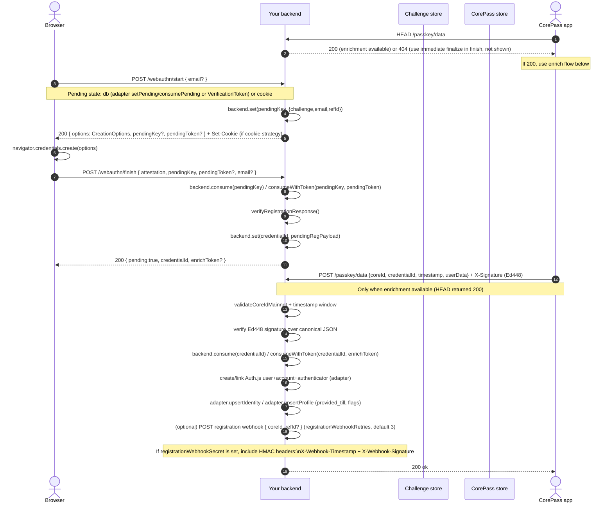

# authjs-corepass-provider

CorePass provider and server helpers for [Auth.js](https://authjs.dev/) (`@auth/core`). This package adds a WebAuthn/Passkey provider (CorePass) and the **pending-by-default** registration flow to your app. You install it in the same project where you use Auth.js and mount the provided handlers on your routes.

**Flow in short:**

- CorePass first checks **`HEAD /passkey/data`**: **200** = enrichment available (finalize strategy **after**), **404** = enrichment not available (finalize strategy **immediate**).
- **If enrichment available (200):** browser does WebAuthn via `POST /webauthn/start` and `POST /webauthn/finish` → server stores pending state (db or cookie) → CorePass app finalizes by calling **`POST /passkey/data`** with an **Ed448-signed** payload.
- **If enrichment not available (404):** browser completes attestation and finalizes in one go via `POST /webauthn/finish` with `coreId` (and optional data); no enrich step (finalize strategy **immediate**).

## What you get

- **Provider**: `CorePass()` (wraps Auth.js WebAuthn with passkey-friendly defaults)
- **Server helpers**: `createCorePassServer()` exposing handlers:
  - `startRegistration(req)`
  - `finishRegistration(req)`
  - `enrichRegistration(req)` (your `/passkey/data`)
  - `checkEnrichment()` (`HEAD /passkey/data`: 200 when finalize strategy is **after**, 404 when **immediate**)
- **DB extension schema**: `db/corepass-schema.sql`

## Flows

### Registration flow (pending-by-default)



### Login flow (standard Auth.js WebAuthn authenticate)

CorePass login is normal WebAuthn: it uses the Auth.js WebAuthn callback path (`action=authenticate`), and resolves the user by stored authenticators.


## Requirements

- **Node.js** 18+ (ESM, native `crypto`).
- **Auth.js**: `@auth/core` (peer dependency) **>=0.34.3** (e.g. 0.34.x, 0.41.x).
- **SimpleWebAuthn** (server) **v10+** required (v13 recommended). The package uses `generateRegistrationOptions` with a `Uint8Array` userID. This package’s **overrides** force `@simplewebauthn/browser` and `@simplewebauthn/server` to **^13.0.0** so that even if `@auth/core` declares an older range, installs use the latest.
- **Frontend**: `@simplewebauthn/browser` in the app that calls your WebAuthn endpoints (e.g. for `startRegistration` / `finishRegistration`).

The package brings in its own runtime dependencies (e.g. `@noble/curves`, `cbor-x`, `blockchain-wallet-validator`) for Ed448 verification and CBOR; you do not install those yourself.

## Install

```bash
npm install authjs-corepass-provider
```

Install peer and frontend deps in your app if not already present:

```bash
npm install @auth/core @simplewebauthn/browser
```

## Auth.js configuration

```ts
import { Auth } from "@auth/core"
import CorePass from "authjs-corepass-provider/provider"

export const auth = (req: Request) =>
  Auth(req, {
    providers: [CorePass()],
    adapter: /* your Auth.js adapter */,
  })
```

## CorePass endpoints

You mount these where you want in your app (framework-specific). The handlers are plain Web API `Request -> Response`.

```ts
import { createCorePassServer, corepassPostgresAdapter } from "authjs-corepass-provider"
// Your Auth.js adapter (e.g. from @auth/pg-adapter or custom)
import { yourAuthJsAdapter } from "..."

// Single unified adapter: merge Auth.js adapter with CorePass store
const adapter = {
  ...yourAuthJsAdapter,
  ...corepassPostgresAdapter({ pool, schema: "public" }),
}

const corepass = createCorePassServer({
  adapter,
  secret: process.env.COREPASS_SECRET!, // required (cookie + VT encryption)
  rpID: "example.com",
  rpName: "Example",
  expectedOrigin: "https://example.com",

  // Pending state: "db" (default) or "cookie"
  // pending: { strategy: "db" },
  // pending: { strategy: "cookie", cookieName: "__corepass_pending", maxAgeSeconds: 120 },

  // Finalize: "after" (default, requires enrich) or "immediate" (single roundtrip; forces cookie pending)
  // finalize: { strategy: "after" },
  // finalize: { strategy: "immediate", maxAgeSeconds: 120 },

  // Optional: unified time config (flow lifetime, registration timeout, timestamp window)
  // time: {
  //   flowLifetimeSeconds: 600,
  //   registrationTimeoutMs: 60000,
  //   timestampWindowMs: 600000, // optional; default equals flow lifetime
  // },
})

// Optional: login webhook (call from Auth.js events.signIn)
// events: {
//   async signIn({ user, account }) {
//     if (account?.provider === "corepass" && account?.type === "webauthn" && user?.id) {
//       await corepass.postLoginWebhook({ userId: user.id })
//     }
//   }
// }
//
// Optional: logout webhook (call from Auth.js events.signOut)
// events: {
//   async signOut({ session }) {
//     // You must be able to map the logout event to a userId.
//     // How you obtain userId depends on your Auth.js setup/session strategy.
//     // If you have it:
//     // await corepass.postLogoutWebhook({ userId })
//   }
// }

export async function POST(req: Request) {
  const url = new URL(req.url)
  if (url.pathname === "/webauthn/start") return corepass.startRegistration(req)
  if (url.pathname === "/webauthn/finish") return corepass.finishRegistration(req)
  if (url.pathname === "/passkey/data") return corepass.enrichRegistration(req)
  return new Response("Not found", { status: 404 })
}

export async function HEAD(req: Request) {
  const url = new URL(req.url)
  if (url.pathname === "/passkey/data") return corepass.checkEnrichment()
  return new Response(null, { status: 404 })
}
```

### Adapter factories

Merge the CorePass store with your Auth.js adapter using the provided adapters (see [Auth.js Database adapters](https://authjs.dev/getting-started/database)):

- **Postgres**: `corepassPostgresAdapter({ pool, schema? })` — use with `@auth/pg-adapter` or any Postgres client that has `.query(text, params)` and optional `.connect()` for transactions.
- **D1 (Cloudflare)**: `corepassD1Adapter(db)` — use with your Auth.js D1 adapter.
- **Supabase**: `corepassSupabaseAdapter(supabase)` — use with your Auth.js Supabase adapter.
- **Xata**: `corepassXataAdapter(client)` — implement `XataLike` (getRecord, createOrUpdateRecord, deleteRecord; optional getIdentityByUserId) with your Xata client.
- **DynamoDB**: `corepassDynamoAdapter({ client, pendingTable?, identitiesTable?, profilesTable? })` — implement `DynamoLike` (put, get, delete; optional queryByUserId for getIdentityByUserId) with your DynamoDB document client.
- **Azure Table Storage**: `corepassAzureTablesAdapter({ client, tableName? })` — implement `AzureTablesLike` (upsertEntity, getEntity, deleteEntity; optional queryEntities) with `@azure/data-tables`.
- **MongoDB**: `corepassMongoAdapter({ client, pendingCollection?, identitiesCollection?, profilesCollection? })` — use with a `MongoLike` db (collection(name) with findOne, insertOne, updateOne, deleteOne, find).
- **PouchDB**: `corepassPouchAdapter(db)` — implement `PouchDBLike` (get, put, remove; optional find for getIdentityByUserId) with PouchDB.

Each adapter implements `setPending`/`consumePending` so **pending.strategy "db"** works without the VerificationToken fallback. For SQL adapters (Postgres, D1), apply the `corepass_pending` table from `db/corepass-schema.sql` or `db/corepass-schema.postgres.sql`. For NoSQL adapters, create equivalent collections/tables (see each adapter’s types for the expected schema).

### Start / finish response shape

- **Start** returns `{ options: CreationOptions, pendingKey?, pendingToken? }`. Use `options` for `navigator.credentials.create(options)`. When pending strategy is **db** (and not cookie), send **pendingKey** (and **pendingToken** if present) in the **finish** request body. When pending is **cookie**, the server sets a cookie and you do not need to send pendingKey.
- **Finish** (body): `{ attestation, pendingKey?, pendingToken?, coreId?, email?, ... }`. For **immediate** finalize, include **coreId** (and optional email/data). For **after** strategy, include **pendingKey** (and **pendingToken** if the backend requires it).
- **Enrich** (`POST /passkey/data`): when the pending backend requires a token (VerificationToken fallback), include **enrichToken** in the body (returned from finish as `enrichToken`).

## Legacy / internal

The following are **not** part of the new unified API but may still be used internally or for migration:

- **Challenge stores** (e.g. Redis, KV) are no longer used. Pending state is stored via **adapter** (db) or **cookie** (encrypted, short TTL). The package no longer exports `memoryChallengeStore`, `redisChallengeStore`, etc.
- **Store factories** (`d1CorePassStore`, `postgresCorePassStore`, `supabaseCorePassStore`) are deprecated; use **corepassD1Adapter**, **corepassPostgresAdapter**, **corepassSupabaseAdapter** and merge with your Auth.js adapter.

### Example: Redis (legacy; not used by new API)

The new API does not use a separate challenge store. Pending state is stored in the **adapter** (table `corepass_pending`) or in an encrypted **cookie**.

### Example: Cloudflare KV

```ts
import { kvChallengeStore } from "authjs-corepass-provider"

// wrangler.jsonc:
// {
//     "kv_namespaces": [
//         { "binding": "COREPASS_KV", "id": "xxxxxxxxxxxxxxxxxxxxxxxxxxxxxxxx" }
//     ]
// }
//
// Worker handler: env.COREPASS_KV is a KVNamespace binding.
//
// const challengeStore = kvChallengeStore(env.COREPASS_KV)
```

### Example: Vercel KV (Redis)

```ts
import { vercelKvChallengeStore } from "authjs-corepass-provider"
import { kv } from "@vercel/kv"

// Vercel manages connection details via environment variables.
// See Vercel KV setup for the required env vars.

const challengeStore = vercelKvChallengeStore({
    set: (key, value, { ex }) => kv.set(key, value, { ex }),
    get: (key) => kv.get<string>(key),
    del: (key) => kv.del(key),
})
```

### Example: Upstash Redis REST (`@upstash/redis`)

```ts
import { upstashRedisChallengeStore } from "authjs-corepass-provider"
import { Redis } from "@upstash/redis"

const redis = new Redis({
    url: process.env.UPSTASH_REDIS_REST_URL!,
    token: process.env.UPSTASH_REDIS_REST_TOKEN!,
})

const challengeStore = upstashRedisChallengeStore({
    set: (key, value, { ex }) => redis.set(key, value, { ex }),
    get: (key) => redis.get<string>(key),
    del: (key) => redis.del(key),
})
```

### Example: Cloudflare Durable Objects

Durable Objects are a good fit if you want low-latency ephemeral state close to your Worker.

```ts
import { durableObjectChallengeStore } from "authjs-corepass-provider"

// Your Durable Object must implement these routes:
// - POST /challenge/put { key, value, ttlSeconds }
// - GET  /challenge/get?key=...
// - POST /challenge/delete { key }
//
// Then:
// const challengeStore = durableObjectChallengeStore(env.COREPASS_DO.get(id))
```

### Example: DynamoDB (AWS SDK v3)

If you already run on AWS and want a managed KV with TTL:

```ts
import { dynamoChallengeStore } from "authjs-corepass-provider"
import { DynamoDBClient } from "@aws-sdk/client-dynamodb"
import { DynamoDBDocumentClient, PutCommand, GetCommand, DeleteCommand } from "@aws-sdk/lib-dynamodb"

const TableName = process.env.COREPASS_CHALLENGE_TABLE!
const ddb = DynamoDBDocumentClient.from(new DynamoDBClient({}))
const nowSec = () => Math.floor(Date.now() / 1000)

// This library doesn't hard-depend on AWS SDK; you provide a small adapter:
const challengeStore = dynamoChallengeStore({
    put: ({ key, value, expiresAt }) =>
        ddb.send(new PutCommand({ TableName, Item: { pk: key, value, expiresAt } })),
    get: async (key) => {
        const res = await ddb.send(new GetCommand({ TableName, Key: { pk: key } }))
        const item = res.Item as { value?: string; expiresAt?: number } | undefined
        if (!item?.value || typeof item.expiresAt !== "number") return null
        if (item.expiresAt < nowSec()) return null
        return { value: item.value, expiresAt: item.expiresAt }
    },
    delete: (key) => ddb.send(new DeleteCommand({ TableName, Key: { pk: key } })),
})
```

### Example: SQL / D1

Use a table like:

```sql
CREATE TABLE IF NOT EXISTS corepass_challenges (
  key TEXT PRIMARY KEY,
  value TEXT NOT NULL,
  expires_at INTEGER NOT NULL
);
CREATE INDEX IF NOT EXISTS idx_corepass_challenges_expires_at ON corepass_challenges(expires_at);
```

Then implement:

```ts
import type { CorePassChallengeStore } from "authjs-corepass-provider"

export function sqlChallengeStore(db: {
  exec: (sql: string, params?: unknown[]) => Promise<unknown>
  get: (sql: string, params?: unknown[]) => Promise<{ value: string; expires_at: number } | null>
}): CorePassChallengeStore {
  const nowSec = () => Math.floor(Date.now() / 1000)

  return {
    async put(key, value, ttlSeconds) {
      const expiresAt = nowSec() + ttlSeconds
      await db.exec(
        "INSERT OR REPLACE INTO corepass_challenges (key, value, expires_at) VALUES (?1, ?2, ?3)",
        [key, value, expiresAt]
      )
    },
    async get(key) {
      const row = await db.get(
        "SELECT value, expires_at FROM corepass_challenges WHERE key = ?1",
        [key]
      )
      if (!row) return null
      if (row.expires_at < nowSec()) {
        await db.exec("DELETE FROM corepass_challenges WHERE key = ?1", [key])
        return null
      }
      return row.value
    },
    async delete(key) {
      await db.exec("DELETE FROM corepass_challenges WHERE key = ?1", [key])
    },
  }
}
```

## Database

Apply your adapter’s default Auth.js schema, then apply:

- `db/corepass-schema.sql` (SQLite/D1)
- `db/corepass-schema.postgres.sql` (PostgreSQL/Supabase)

This adds:

- `corepass_pending_registrations`
- `corepass_identities` (CoreID → Auth.js `userId` mapping)
- `corepass_profiles` (CorePass metadata like `o18y`, `kyc`, `provided_till`)

## Options

- **`allowedAaguids`**: defaults to CorePass AAGUID `636f7265-7061-7373-6964-656e74696679`. Pass a string or an array of AAGUIDs. Set to `false` to allow any authenticator.
- **`pubKeyCredAlgs`**: defaults to `[-257, -7, -8]` (RS256, ES256, Ed25519).
- **WebAuthn registration options** (optional overrides; defaults are passkey-friendly and privacy-friendly):
  - **`attestationType`**: `"none"` (default), `"indirect"`, or `"direct"`.
  - **`authenticatorAttachment`**: `"cross-platform"` (default) or `"platform"`.
  - **`residentKey`**: `"preferred"` (default), `"required"`, or `"discouraged"`.
  - **`userVerification`**: `"required"` (default), `"preferred"`, or `"discouraged"`.
  - **`transports`**: optional array of authenticator transports to request. **Default:** omitted (not set); the browser decides which authenticators to offer. Sent to the client in the registration options; the browser uses it as a **hint** for which kinds of authenticators to prefer or offer. The client is not required to restrict to these—it may still show other authenticators. Each value means:
    - **`internal`**: authenticator is bound to the device (e.g. built-in Touch ID / Face ID, Windows Hello). Typically shown as “this device” or “phone / laptop built-in”.
    - **`hybrid`**: can use a separate device over a combination of transport and proximity (e.g. phone as passkey for a desktop). Often shown as “other device” or “phone” when signing in elsewhere.
    - **`usb`**: security key over USB. User plugs in a hardware key.
    - **`nfc`**: security key over NFC. User taps a hardware key to the device.
    - **`ble`**: security key over Bluetooth Low Energy. User pairs/taps a BLE key.
    If omitted, the browser chooses which authenticators to offer; the authenticator may still report its transports in the attestation (stored for later sign-in hints).
- **`secret`**: **required**. Used to encrypt/sign the pending cookie (when pending strategy is **cookie**) and for VerificationToken-based pending (when using Auth.js VT adapter fallback).
- **`pending`**: pending state strategy. **`{ strategy: "db" }`** (default): use adapter `setPending`/`consumePending` if present, else Auth.js VerificationToken methods (client must send `pendingToken` from start to finish/enrich). **`{ strategy: "cookie", cookieName?, maxAgeSeconds? }`**: store pending in an encrypted cookie (default TTL 120s). When **finalize** is **immediate**, pending is forced to **cookie**.
- **`finalize`**: **`{ strategy: "after" }`** (default): registration is finalized only after enrich (`POST /passkey/data` with Ed448 signature). **`{ strategy: "immediate", maxAgeSeconds? }`**: `finishRegistration` can finalize in one roundtrip when `coreId` is provided; forces **pending** to **cookie**; `HEAD /passkey/data` returns **404**.
- **`emailRequired`**: defaults to `false` (email can arrive later via `/passkey/data`). If no email is provided, the user is created with email undefined; when a real email is provided later it is updated.
- **`requireO18y`**: defaults to `false`. If enabled, `/passkey/data` must include `userData.o18y=true` or finalization is rejected. Not enforced for immediate-finalize.
- **`requireO21y`**: defaults to `false`. If enabled, `/passkey/data` must include `userData.o21y=true` or finalization is rejected. Not enforced for immediate-finalize.
- **`requireKyc`**: defaults to `false`. If enabled, `/passkey/data` must include `userData.kyc=true` or finalization is rejected. Not enforced for immediate-finalize.
- **`enableRefId`**: defaults to `false`. When enabled, the server generates and stores a `refId` (UUIDv4) for the CoreID identity and can include it in webhooks. When disabled, no `refId` is generated or stored.
- **Registration webhook options**:
  - **`postRegistrationWebhooks`**: defaults to `false`.
  - **`registrationWebhookUrl`**: required if `postRegistrationWebhooks: true`.
  - **`registrationWebhookSecret`**: optional. If set, requests are HMAC-signed (SHA-256) using `timestamp + "\\n" + body` and include `X-Webhook-Timestamp` (unix seconds) and `X-Webhook-Signature` (`sha256=<hex>`).
  - **`registrationWebhookRetries`**: defaults to `3` (range `1-10`). Retries happen on non-2xx responses or network errors.
- **Login webhook options**:
  - **`postLoginWebhooks`**: defaults to `false`.
  - **`loginWebhookUrl`**: required if `postLoginWebhooks: true`.
  - **`loginWebhookSecret`**: optional. Same signing format/headers as registration.
  - **`loginWebhookRetries`**: defaults to `3` (range `1-10`). Retries happen on non-2xx responses or network errors.
- **Logout webhook options**:
  - **`postLogoutWebhooks`**: defaults to `false`.
  - **`logoutWebhookUrl`**: required if `postLogoutWebhooks: true`.
  - **`logoutWebhookSecret`**: optional. Same signing format/headers as registration.
  - **`logoutWebhookRetries`**: defaults to `3` (range `1-10`). Retries happen on non-2xx responses or network errors.
- **`time`**: unified timing (all derived from a single flow lifetime):
  - **`flowLifetimeSeconds`**: canonical flow TTL; default **600** (10 min), or **120** when **finalize.strategy** is **immediate** and not overridden. Drives pending TTL, cookie max-age, and token expiry.
  - **`registrationTimeoutMs`**: WebAuthn creation/assertion UX timeout; default **60000** (60 s); clamped to ≤ flow lifetime.
  - **`timestampWindowMs`**: enrichment request timestamp tolerance (ms); default = flow lifetime in ms; clamped to ≥ registrationTimeoutMs and ≤ flow lifetime.

## Enrichment payload (`/passkey/data`)

The CorePass app sends:

- **Body**: `{ coreId, credentialId, timestamp, userData }`
- **Header**: `X-Signature` (Ed448 signature)

### Canonical payload + signature input

For signature verification, the server **does not** use the raw request body bytes. Instead it:

- **Canonicalizes JSON**: recursively sorts object keys alphabetically and serializes with `JSON.stringify(...)` (so it is **minified**, no whitespace).
- **Builds signature input** as:

```text
signatureInput = "POST\n" + signaturePath + "\n" + canonicalJsonBody
```

Then it verifies `X-Signature` (Ed448) over `UTF-8(signatureInput)`.

This means the CorePass signer must sign the **same canonical JSON string** (alphabetically ordered + minified) and the same `signaturePath` (defaults to `/passkey/data`, configurable via `signaturePath`).

### Timestamp units

`timestamp` is required and must be a **Unix timestamp in microseconds**.

`userData` fields:

| Field | Type | Example | Notes |
| - | - | - | - |
| `email` | `string` | `user@example.com` | Optional. If omitted, user email is left undefined; if provided later, Auth.js user email is updated. |
| `o18y` | `boolean (or 0/1)` | `true` | Stored in `corepass_profiles.o18y`. |
| `o21y` | `boolean (or 0/1)` | `false` | Stored in `corepass_profiles.o21y`. |
| `kyc` | `boolean (or 0/1)` | `true` | Stored in `corepass_profiles.kyc`. |
| `kycDoc` | `string` | `PASSPORT` | Stored in `corepass_profiles.kyc_doc`. |
| `dataExp` | `number` | `43829` | Minutes. Converted to `provided_till`. |

`refId` is **not part of CorePass `/passkey/data`**. If you need an external correlation id, enable `enableRefId` and deliver it via your webhooks.

### Email when not provided

Email is **not required** unless you set **`emailRequired: true`**. When no email is supplied at finalization, the user is created with email **undefined**. If a real email is provided later (e.g. in `userData.email`), the user is updated via `adapter.updateUser`. Your adapter and database must allow missing/null email.

### `provided_till` calculation

`provided_till` is stored as a **Unix timestamp in seconds**:

```text
provided_till = floor(now_sec) + dataExpMinutes * 60
```

## Notes on Auth.js internals

Auth.js’ built-in WebAuthn flow normally creates the user/account/authenticator during the WebAuthn callback. CorePass intentionally delays this until enrichment, so it uses custom endpoints instead of Auth.js’ built-in “register” callback path.

## Upstream references

- Auth.js contributing guide: `https://raw.githubusercontent.com/nextauthjs/.github/main/CONTRIBUTING.md`
- Auth.js built-in Passkey provider: `https://raw.githubusercontent.com/nextauthjs/next-auth/main/packages/core/src/providers/passkey.ts`
