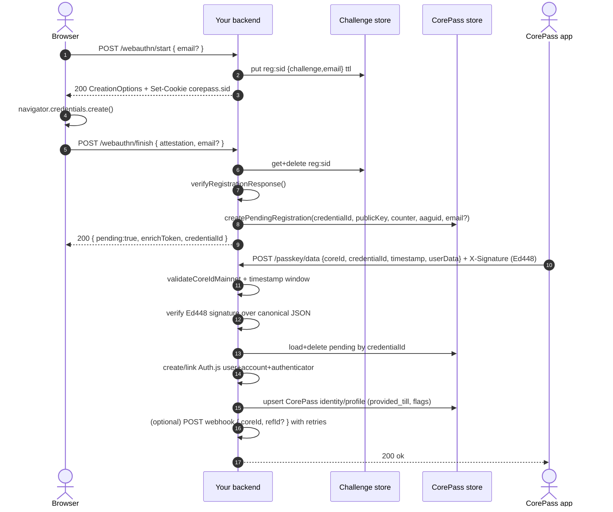
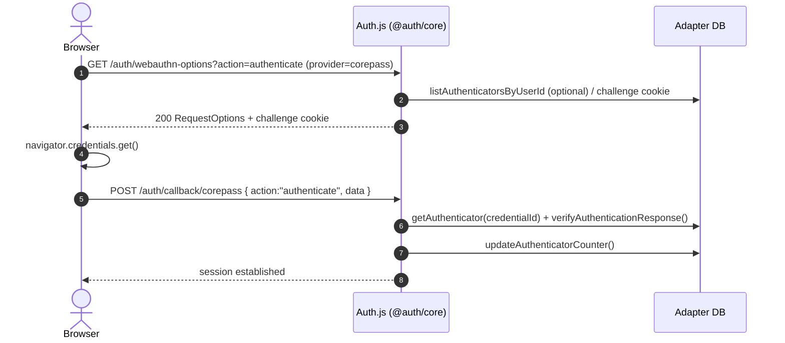

# authjs-corepass-provider

CorePass provider + server helpers for Auth.js (`@auth/core`) implementing the **pending-by-default** registration flow:

- Browser completes WebAuthn attestation (registration)
- Server stores a **pending registration** (no Auth.js user/account/authenticator yet)
- CorePass mobile app finalizes the account by calling **`POST /passkey/data`** with an **Ed448-signed** payload

This design is based on the existing Cloudflare Worker implementation in `wall-func-injector`.

## What you get

- **Provider**: `CorePass()` (wraps Auth.js WebAuthn with passkey-friendly defaults)
- **Server helpers**: `createCorePassServer()` exposing handlers:
  - `startRegistration(req)`
  - `finishRegistration(req)`
  - `enrichRegistration(req)` (your `/passkey/data`)
- **DB extension schema**: `db/corepass-schema.sql`

## Flows

### Registration flow (pending-by-default)



### Login flow (standard Auth.js WebAuthn authenticate)

CorePass login is normal WebAuthn: it uses the Auth.js WebAuthn callback path (`action=authenticate`), and resolves the user by stored authenticators.



## Install

```bash
npm install authjs-corepass-provider
```

You also need:

- `@auth/core` (peer dependency)
- `@simplewebauthn/browser` in your frontend (Auth.js recommends `9.0.1`, same as Passkey docs)

## Auth.js configuration

```ts
import { Auth } from "@auth/core"
import CorePass from "authjs-corepass-provider/provider"

export const auth = (req: Request) =>
  Auth(req, {
    providers: [CorePass()],
    adapter: /* your Auth.js adapter */,
  })
```

## CorePass endpoints

You mount these where you want in your app (framework-specific). The handlers are plain Web API `Request -> Response`.

```ts
import { createCorePassServer } from "authjs-corepass-provider"

const corepass = createCorePassServer({
  adapter: /* Auth.js adapter (must implement WebAuthn + user methods) */,
  store: /* CorePassStore implementation (pending regs + coreId mapping + profile) */,
  challengeStore: /* CorePassChallengeStore implementation (KV/Redis/etc) */,
  rpID: "example.com",
  rpName: "Example",
  expectedOrigin: "https://example.com",

  // default: pending registrations are required
  allowImmediateFinalize: false,
})

export async function POST(req: Request) {
  const url = new URL(req.url)
  if (url.pathname === "/webauthn/start") return corepass.startRegistration(req)
  if (url.pathname === "/webauthn/finish") return corepass.finishRegistration(req)
  if (url.pathname === "/passkey/data") return corepass.enrichRegistration(req)
  return new Response("Not found", { status: 404 })
}
```

## Database

Apply your adapter’s default Auth.js schema, then apply:

- `db/corepass-schema.sql`

This adds:

- `corepass_pending_registrations`
- `corepass_identities` (CoreID → Auth.js `userId` mapping)
- `corepass_profiles` (CorePass metadata like `o18y`, `kyc`, `provided_till`)

## Options

- **`allowedAaguids`**: defaults to CorePass AAGUID `636f7265-7061-7373-6964-656e74696679`. Set to `false` to allow any authenticator.
- **`pubKeyCredAlgs`**: defaults to `[-257, -7, -8]` (RS256, ES256, Ed25519).
- **`allowImmediateFinalize`**: if enabled, `finishRegistration` may finalize immediately if `coreId` is provided in the browser payload. This is **disabled by default** because it weakens the CoreID ownership guarantee (the default flow requires the Ed448-signed `/passkey/data` request).
- **`emailRequired`**: defaults to `false` (email can arrive later via `/passkey/data`). If no email is ever provided, the library creates the Auth.js user with a deterministic synthetic email and updates it once a real email is received.
- **`enableRefId`**: defaults to `false`. When disabled, any `refId` passed in requests is ignored and never stored.
- **`postWebhooks`**: defaults to `false`. When enabled, a webhook POST is sent after finalization with `{ coreId, refId? }`.
- **`webhookUrl`**: required if `postWebhooks: true`.
- **`webhookRetries`**: defaults to `3` (range `1-10`). Retries happen on non-2xx responses or network errors.

## Enrichment payload (`/passkey/data`)

The CorePass app sends:

- **Body**: `{ coreId, credentialId, timestamp, userData }`
- **Header**: `X-Signature` (Ed448 signature)

`userData` fields:

| Field | Type | Example | Notes |
| - | - | - | - |
| `email` | `string` | `user@example.com` | Optional. If provided later, Auth.js user email is updated. |
| `o18y` | `boolean (or 0/1)` | `true` | Stored in `corepass_profiles.o18y`. |
| `o21y` | `boolean (or 0/1)` | `false` | Stored in `corepass_profiles.o21y`. |
| `kyc` | `boolean (or 0/1)` | `true` | Stored in `corepass_profiles.kyc`. |
| `kycDoc` | `string` | `PASSPORT` | Stored in `corepass_profiles.kyc_doc`. |
| `dataExp` | `number` | `43829` | Minutes. Converted to `provided_till`. |

`refId` is **not part of CorePass `/passkey/data`**. If you need an external correlation id, enable `enableRefId` and deliver it via your webhook (`postWebhooks`).

### `provided_till` calculation

`provided_till` is stored as a **Unix timestamp in seconds**:

\[
provided\_till = \lfloor now\_sec \rfloor + dataExpMinutes \times 60
\]

## Notes on Auth.js internals

Auth.js’ built-in WebAuthn flow normally creates the user/account/authenticator during the WebAuthn callback. CorePass intentionally delays this until enrichment, so it uses custom endpoints instead of Auth.js’ built-in “register” callback path.

## Upstream references

- Auth.js contributing guide: `https://raw.githubusercontent.com/nextauthjs/.github/main/CONTRIBUTING.md`
- Auth.js built-in Passkey provider: `https://raw.githubusercontent.com/nextauthjs/next-auth/main/packages/core/src/providers/passkey.ts`
